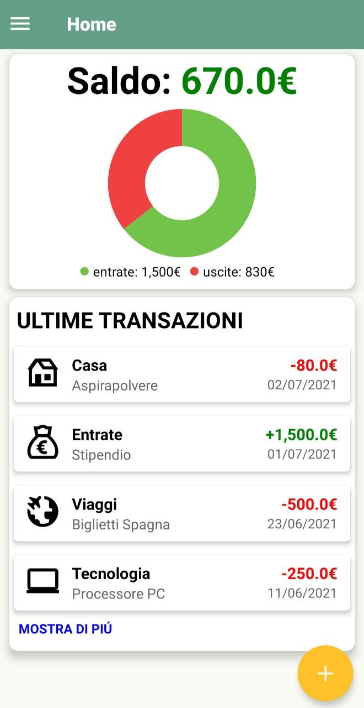
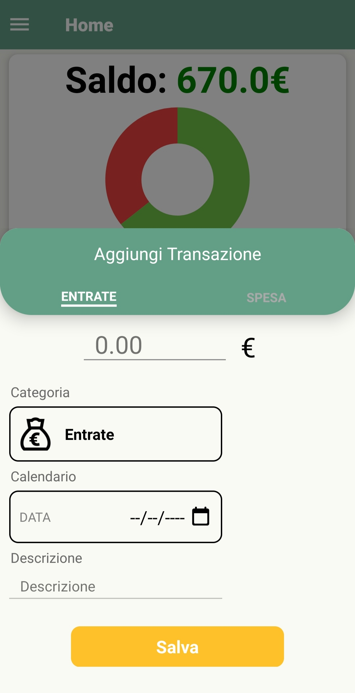
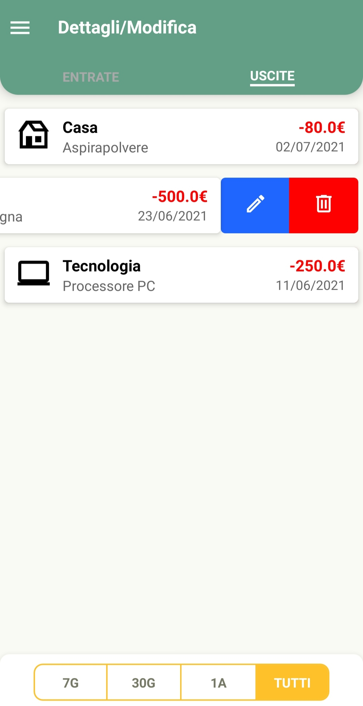
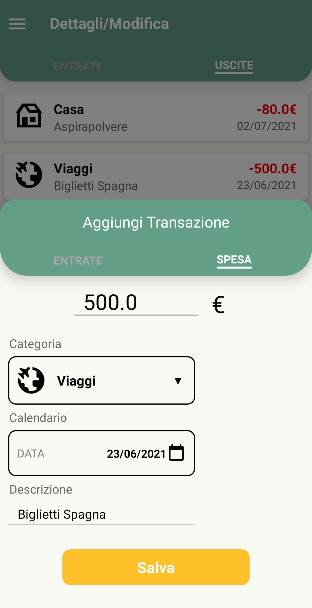
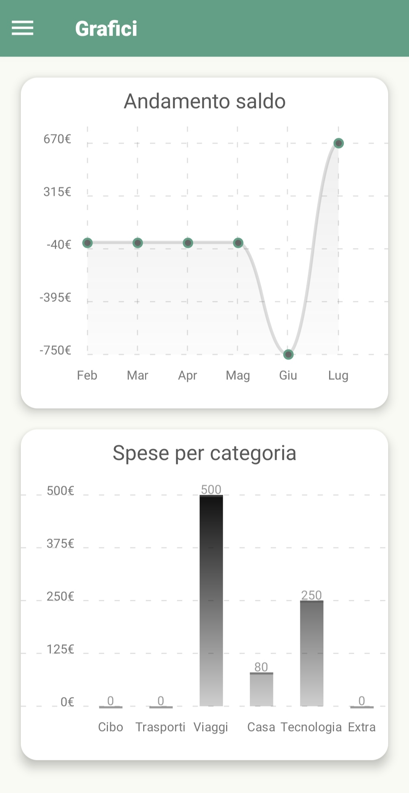
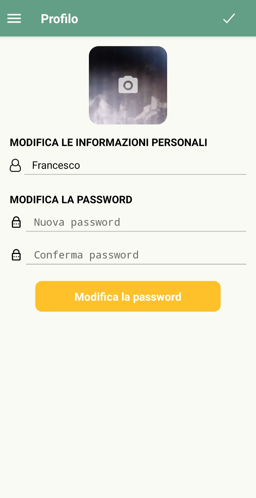

# Wall-et

  

 

Virtual wallet manager

## Screenshots

### Main Screen and Transaction Screen
The main screen is divided into different sections:
- The current balance and a chart showing the total of expenses and income
- A short list of the first 4 transaction (by clicking on the "mostra di piu" button you get redirected to the transaction list page)
- A floating button to add a transaction

The transaction screen contains different aspects to create the transaction.
Apart the classic functionalities, an interesting one is:
- Changing the currency by clicking on the ``€`` symbol (dollars, pounds and euros are supported)

  
  

### Record Screen
Another interesting functionality is the ability to view a list of transactions within various time intervals (7d, 30d, 1y, all time)
and modify or delete them even after creation. This functionality is made possible through a swipe list.

  
  

### Charts Screen and Profile Screen
The charts screen offers two interesting charts:
- The first one shows the balance trend in the last six months. By clicking on the visible points, the amount of money gets shown
- The second one shows the all time total expenses for each category

The profile screen contains different functionalities to modify your profile:
- Changing the profile image by clicking directly on the image
- Changing the username and password

  
  

